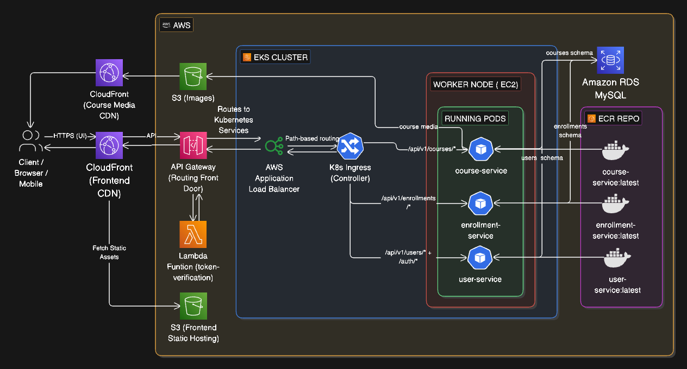

# courses-no-one-asked-for

<p align="center">
  
</p>

## About

**courses-no-one-asked-for (CNOAF)** is an online course enrollment platform created as part of the **BeautyOfCloud 2.0 System Design Challenge** organized at the **University of Sri Jayewardenepura (USJP) - 2026**.

The project explores how a modern online learning platform can be designed using a decoupled microservice architecture while focusing on cloud-native deployment and scalable infrastructure on AWS.

Read more: [Project Blog](https://bootarc.vercel.app/blog/system-design-challenge)

---

## Project Overview

The platform allows users to:

- Authenticate user
- Browse available courses
- Enroll in courses
- Manage enrollments
- Access course information

The main goal of this project is to demonstrate a scalable cloud architecture using:

<p align="center">
  <a href="https://skillicons.dev">
    
  </a>
</p>

AWS services used in the design include:

- Amazon S3
- Amazon CloudFront
- Amazon API Gateway
- Application Load Balancer
- Amazon EKS
- Amazon ECR
- Amazon RDS (MySQL)

---

## Repository Structure

```text
.
├── assets/           # Project assets and diagrams
├── client/           # Frontend application
├── server/           # Backend microservices
├── infrastructure/   # AWS and Kubernetes resources
└── README.md
```

<p align="center">
  <a href="./server/README.md">Backend Docs</a> ·
  <a href="./client/README.md">Frontend Docs</a> ·
  <a href="./infrastructure/README.md">Infrastructure Docs</a>
</p>

---

## Author

Built by **[Dineth Dilhara](https://x.com/Dineth_Dilhara/status/2064969963975401552?s=20)** with 🤍 · [Announcement](https://x.com/tikirimaarie/status/2065110132489642174)
